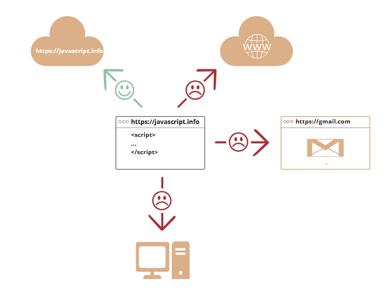

# An Introduction to JavaScript

Let’s see what’s so special about JavaScript, what we can achieve with it, and what other technologies play well with it.

---

## What is JavaScript?

JavaScript was initially created to **“make web pages alive.”**

The programs in this language are called **scripts**. They can be written right in a web page’s HTML and run automatically as the page loads.

Scripts are provided and executed as plain text. They **don’t need special preparation or compilation** to run.

In this aspect, JavaScript is very different from another language called **Java**.

---

## Why is it called JavaScript?

When JavaScript was created, it initially had another name: **“LiveScript.”** But Java was very popular at that time, so it was decided that positioning a new language as a _“younger brother”_ of Java would help.

However, JavaScript became a fully independent language with its own specification called **ECMAScript**, and now it has no relation to Java at all.

Today, JavaScript can execute:

- In the **browser**
- On the **server**
- On **any device** with a JavaScript engine

### JavaScript Engines

Different browsers use different JavaScript engines:

- `V8` – in Chrome, Opera, and Edge
- `SpiderMonkey` – in Firefox
- Others: `Chakra` (IE), `JavaScriptCore`, `Nitro`, `SquirrelFish` (Safari)

These terms are useful to know because they’re often mentioned in developer articles.

---

## How do engines work?

JavaScript engines are complex, but here’s a simplified explanation:

1. The engine **parses** the script.
2. It **compiles** it into machine code.
3. The machine code is **executed**.

The engine also applies **optimizations** at every step. It even monitors how the code runs and dynamically improves performance as it executes.

---

## What can in-browser JavaScript do?

Modern in-browser JavaScript is a **safe** language. It doesn't give access to:

- Memory
- The CPU

Instead, it can:

- Add or change HTML and CSS on the page
- Respond to user interactions (clicks, key presses)
- Send/receive requests (AJAX/COMET)
- Work with cookies
- Show alerts, confirmations, prompts
- Store data locally (`localStorage`, `sessionStorage`)

---

## What CAN’T in-browser JavaScript do?

JavaScript in the browser has limitations for **security reasons**:

- Cannot read/write arbitrary files or access OS-level functions
- File access is limited to user-initiated actions (e.g. selecting files)
- Cannot access cameras/microphones without explicit permission
- Cannot freely interact with other tabs/windows (due to **Same Origin Policy**)
- Cannot send/receive data from another domain unless explicitly allowed (via CORS)

> Outside of the browser (e.g. in Node.js), many of these limitations do not apply.

---

## What makes JavaScript unique?

JavaScript stands out because of:

1. **Full integration** with HTML/CSS
2. **Simple things are simple** to do
3. **Supported by all major browsers** by default

JavaScript is the only technology that brings these together, making it **the most widespread tool** for creating web interfaces.

It can also be used to:

- Build **servers**
- Create **mobile apps**
- Develop **desktop applications**

---

## Languages “over” JavaScript

Many developers want features not natively available in JavaScript. So several **transpiled languages** have emerged:

| Language     | Highlights                                   | Developed By |
| ------------ | -------------------------------------------- | ------------ |
| CoffeeScript | Cleaner, shorter syntax (loved by Ruby devs) | —            |
| TypeScript   | Strong typing for large-scale systems        | Microsoft    |
| Flow         | Static typing alternative                    | Facebook     |
| Dart         | Can run in its own engine or transpile to JS | Google       |
| Brython      | Allows writing browser code in Python        | —            |
| Kotlin       | Concise, safe, targets browser or Node       | JetBrains    |

> Even if you use one of these, **knowing JavaScript is essential**.

---

## Summary

- JavaScript began as a **browser-only** language, but now runs in many environments.
- It is the most **widely-adopted** browser scripting language.
- There are many **transpiled languages**, but understanding JavaScript remains critical for web development.

---
